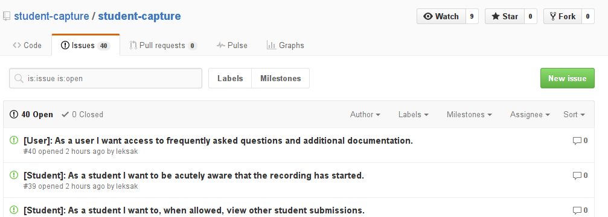
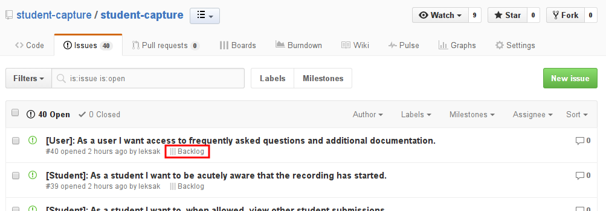
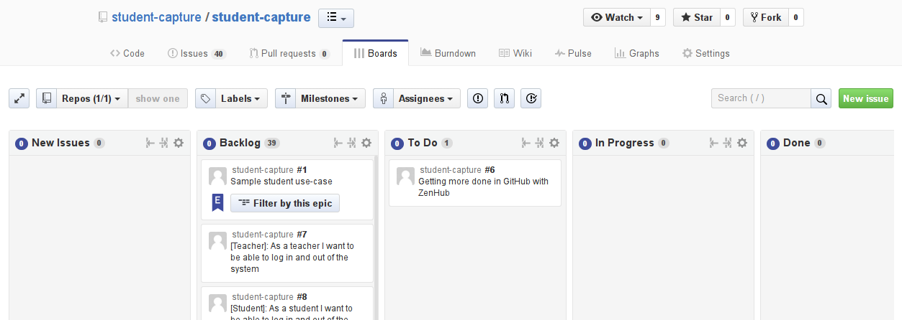

Student Capture
===============

# Getting started

The first few sections describe the project, refer to the later
sections for
[getting started (link to relevant sections)](#how-do-i-get-started).

# What is it?

Student capture is an online software application that enables student
to, when presented with a video question from their teacher, provide a
video- and audio submission to the particular question.

The teacher is then at the conclusion of an exam able to review and
grade the exam.

[A sample student use-case:](https://github.com/student-capture/student-capture/issues/1)
+ Students navigate to the course on the particular Learning Management System
+ When a student starts an exam, he or she is unable to pause, rewind or delay
  the exam.
+ Within the user interface, inside a frame the course tutor presents
  (in a videoformat) a question to the student. For an example: A police
  cadet is shown a demonstration which becomes hostile and loud and is
  escalating toward violence. Based on their safety regulations
  (supplied outside the system and previous to the examination), the
  police cadet has to make a quick decision which could in real-life
  have severe consequences. The lecturer poses the
  question/situation. 
+ When the video of the lecturer comes to an end, and after a
  specified set of time the student is recorded.
+ After the elapsed, previously specified time frame, the student
  webcam is activated and the student is being recorded
  (arguably the student should be able to view themselves live).
+ After having been graded the student may, for each submitted answer:
    + View the question that corresponds with the particular answer
    + Watch their own recording
    + Review the teacher feedback
    + Review their grade (if set on a per-question basis)

# Background

At most universities around the world, the standard lecture-based
course with a memory test exam at the end is the default norm. It is a
norm which has been in place for several decades, especially for
foundation level undergraduate courses. In many of our courses, here
at [Umeå University](http://www.umu.se/english/?languageId=1),
students are often assigned readings from a textbook prior to
class. During class, they are lectured on the material in the book, or
surrounding the book.

Most courses are examined after a specific time period, using
memory-based exams where students are sat in isolation ready to
regurgitate memorized information using a pencil or a ball-point pen.

Regardless of the nature of the course being studied, **content
examinations** are almost exclusively of a single modality; that is, the
written form. In the product owner's previous experience, students who
pass are oftentimes reasonably satisfied with course structure which
result in positive student evaluations and comments that they have
enjoyed the course far more than they had expected. 

Regardless of students being satisfied or not, there are problems with
regard to nature of teaching, learning and examination. With regard to
teaching and learning, some students rarely read the book either prior
to or after class. Despite trying multiple incentive systems, students
resist reading the book prior to class, commenting that it was too
difficult. 

Because of this, we lectured on the content they were supposed to
read. Given this structure, it is not surprising that students rarely
read the book after class, either. In fact, on end of course
evaluations students frequently commented that the textbook was
unnecessary. Consequently, we were inadvertently teaching students
that they do not need to read. Another problem is that students have
poor long term retention of the material being lectured and
examined. In fact lecturers of subsequent courses in our curriculum
indicate that students forgot a lot from their foundation course,
Consequently, they sometimes need to re-teach basic concepts.

In recent years, some lecturers have adopted a flipped classroom
environment – a method that the product owner has employed
since 2005. The flipped classroom, in case you are not familiar with
the term, is a teaching method in which students study a topic at home
by watching a video prepared or set by their tutor in advance of their
regular lesson. The classroom lesson which follows then provides the
opportunity for students to ask questions and to perform practical
activities under their teacher's guidance; in other words, initial
lessons become homework, while the traditional homework element of
applying the learning through exercises and other activities moves
into the classroom. Flipped learning allows for a much more
interactive classroom lesson, with the teacher helping students when
they are stuck as opposed to the traditional set-up of students
passively listening to lectures and taking their assignments home
afterwards. It's sometimes also called the 'backwards' or 'inverted
classroom', or 'reverse teaching'.

Flipped learning is a relatively new concept which gained traction in
the latter part of the last decade thanks to increased access to the
internet and the wider availability of online course managemen t
tools, such as Cambro and Moodle. It has the benefit of allowing
students to work through subject matter at their own pace so that
theoretically they can come to the classroom with the same level of
knowledge as their peers. Classroom time is thus freed up for students
to collaborate and to help each other through hands-on lesson
activities, while the role of the teacher changes "from sage on the
stage to guide on the side". The teacher can take more time to explain
difficult concepts, and students who might struggle and fail to
complete tasks set as homework can be coached and get the immediate
classroom support they need.

This means that they (the students) get less frustrated and therefore
less likely to drop out of their studies.  The infrastructure and the
technology needed to present lectures in a flipped classroom format
are readily available and in use at
[Umeå University](http://www.umu.se/english/?languageId=1) even though
only a small percentage of faculty, i.e. teachers, actually use this
method. However, this should improve as of April 2016 when Umeå
University incorporates Kaltura (UmU Play) as a method for
'lecture-capture'.

Teachers will no longer need to download licensed software, and they
will no longer have to upload their videos in public domains such as
[YouTube](https://www.youtube.com/) and
[Vimeo](https://vimeo.com/). With [UmU Play](https://play.umu.se/),
teachers are able to upload their screen recorded videos onto a
university owned domain, and to then link or embed within their
**LMS** (learning management system).

Although many universities are flipping their learning environments,
what is happening with examination methods? Unfortunately, not too
much _except_ for several ongoing projects about digital
assessment. Sadly, the sole focus of these digital assessment models
are on the written form. Teachers are once again assured that the
person writing the exam has been verified as the student (via student
identification) and that the exam has been monitored (hence no
cheating has taken place). 'Digital assessment' as used here is not an
all-encapsulating term for assessment. What it is in reality is a
plug-in downloaded onto a student's laptops which temporarily locks
the laptops at a given time, limiting students to only be able to use
the word processor. That way, student exams become legible for
examiners.  Eureka! The promised land is here! The classic memory
based 'salstenta' has received a digital lifeline so that now students
can write their exams with their laptops instead of with a pencil. In
other words, 'same shit, different way (instead of day)' Is this
really pedagogical development? So the classic examination form is
maintained, and lecturers can then feel satisfied that they are using
digital tools, and students have thus entered into the realms of
modern technology.

Sad times, me [the product owner] thinks! If we want to raise a
generation of students who can think critically and do more than
repeat facts, we need to drastically change our entire exam and
assessment system.  Universities are meant to produce well-rounded and
intelligent individuals who can work productively and contribute to
society. Yet in actual fact, student are lavished with the best grades
based on how well they can memorise huge numbers of facts and
arguments. So long as they can regurgitate them sufficiently well in a
five- hour period, it matters not at all to our system whether they're
retained for even a day afterwards.  At Umeå University, there are
some lecturers who have incorporated continuous assessment into the
course structure, including online equizzes during the course as well
as other forms of formative and summative assessment.

That said, most forms of assessment are still only using a single form
of modality: the written form.  At HUMfak (the humanities faculty),
several teachers are currently using audio/video tools for formative
and summative assessment. These tools include:

+ [VoiceThread](https://voicethread.com)
+ [PresentMe](https://present.me/content/)

These tools are a form of student capture allowing students to rec ord
themselves using audio, video or both. With
[VoiceThread](https://voicethread.com), students can make comments
about a text, image or video whilst with
[PresentMe](https://present.me/content/), students can upload
Powerpoints and then add audio and video of themselves giving the
presentation. What is missing for a lot of staff is the aspect of
monitoring students. In order words, the desire to record audio and
video but in an exam environment.

# How do I get started?

To get up and running there are a few things that you will want to know,

1. How do I know what to do? [1](#how-do-i-know-what-to-do)
2. How do I know where to store my high-level documentation (for posterity)?
3. How can I work independently on a feature and test it without
   breaking the build?
4. How can I integrate my changes with the rest of the system?

## How do I know what to do?

You are ready to get started with contributing, but you have no idea
what has yet to be done, what tasks and user stories to address later
and how those tasks are prioritized.

You will want to see

+ What should be done on the next sprint?
+ What items may we use this sprint?
+ What is someone else already working on?
+ What has already been done?

Given the scale of the project you will want to get a third-party
extension called "[Zenhub](https://www.zenhub.io/)" which is a
browser-extension. 

We use [Zenhub](https://www.zenhub.io/) to find answers to the
questions that we just posed.

Without [Zenhub](https://www.zenhub.io/) we can only view our issues
in an unsorted manner and we can only organize them through the use of
coloured labels which causes a cognitive overhead for all.

The above figure shows how the issues (created at the start of the
project) are without any priority and there is no immediate feedback
as to their current state.

With [Zenhub](https://www.zenhub.io/) the above view allows us to
observe how each issue is catalogued (here all the tasks are in
the backlog, notice how an icon has appeared below the title
of the issue):

The other _important_ Zenhub feature is "**boards**",

It is in the
[boards tab](https://github.com/student-capture/student-capture#boards)
that we organize our work,

The above image was captured at the start of the very first sprint on
the project, so all _real_ issues are stored in the backlog in their
order of priority (high-priority at the top. Low priority at the
bottom). Maintaining the backlog and selecting user stories for the
current sprint is mainly the responsibility of the product owners.

The "**To Do**" list are all tasks that are to be completed _this_ sprint.
"**In progress**" are the tasks that someone is working on (they have
"_claimed_" it) and the "**Done**" list is all the tasks that have been
completed.

There is also an "**Epic**" shown in the image, but describing those is outside the scope of this
document and is excellently described in the
[official documentation](https://www.zenhub.io/blog/working-with-epics-in-github/).
You do _not_ need to understand Epics to get started.

You now know the answer to all of these questions,

+ What should be done on the next sprint?
+ What items may we use this sprint?
+ What is someone else already working on?
+ What has already been done?

